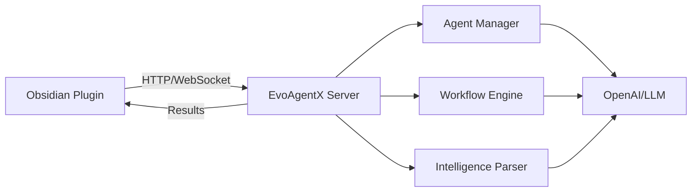

# EvoAgentX Obsidian Integration - Implementation Summary

## Overview

I have successfully implemented comprehensive backend API functionality to make EvoAgentX callable by an Obsidian plugin. This implementation provides a full-featured integration that enables agentic AI capabilities directly within Obsidian vaults.

## What Was Implemented

### 1. Backend API Infrastructure

**New Files Created:**
- `server/models/obsidian_schemas.py` - Pydantic models for all API requests/responses
- `server/api/obsidian.py` - Complete FastAPI router with all Obsidian endpoints
- `server/core/obsidian_websocket.py` - WebSocket manager for real-time communication

**Enhanced Files:**
- `server/main.py` - Added Obsidian router and WebSocket endpoints
- `server/requirements.txt` - Added necessary dependencies

### 2. Core API Endpoints

The `/api/obsidian/` namespace provides:

#### Chat & Conversation
- `POST /api/obsidian/chat` - Agent chat functionality
- `POST /api/obsidian/conversation/history` - Retrieve chat history
- `DELETE /api/obsidian/conversations/{id}` - Delete conversations

#### AI Capabilities
- `POST /api/obsidian/copilot/complete` - Text completion/suggestions
- `POST /api/obsidian/workflow` - Execute complex agentic workflows
- `POST /api/obsidian/intelligence/parse` - Advanced context parsing

#### Agent Management
- `GET /api/obsidian/agents` - List available agents
- `POST /api/obsidian/agents/create` - Create custom agents
- `POST /api/obsidian/agent/execute` - Execute specific agent actions

#### Vault Integration
- `POST /api/obsidian/vault/context` - Analyze vault content for insights
- `POST /api/obsidian/planning/tasks` - AI-powered task planning
- `POST /api/obsidian/memory/update` - Update user memory/context

#### System
- `GET /api/obsidian/health` - Health check and status

### 3. Real-time Communication

**WebSocket Endpoint:** `ws://localhost:8000/ws/obsidian`

Features:
- Real-time agent responses
- Workflow progress updates
- Live copilot suggestions
- Vault synchronization
- Connection management per vault

### 4. Example Obsidian Plugin

**Location:** `examples/obsidian-plugin/`

Complete TypeScript plugin with:
- Chat modal interface
- Copilot text completion
- Workflow execution modal
- Vault analysis commands
- Settings configuration
- WebSocket integration
- Error handling

### 5. Documentation & Testing

**Documentation:**
- `docs/obsidian-integration.md` - Comprehensive integration guide
- `examples/obsidian-plugin/README.md` - Plugin-specific documentation
- Updated main `README.md` with Obsidian integration section

**Testing:**
- `test_obsidian_api.py` - Automated API testing script
- Example API usage in all documentation

### 6. Setup & Deployment

**Scripts:**
- `setup-obsidian.sh` - One-command setup script
- `start-obsidian-server.sh` - Server startup script
- Both scripts are executable and include error handling

## Key Features Implemented

### 🤖 Agent Chat
- Conversational AI interface within Obsidian
- Persistent conversation history
- Context-aware responses
- Multiple agent support

### ✍️ Copilot Features
- Intelligent text completion
- Context-aware suggestions
- File-type specific completions
- Cursor position awareness

### ⚙️ Workflow Execution
- Full EvoAgentX workflow integration
- Complex task automation
- Progress tracking via WebSocket
- Results saved as Obsidian notes

### 📚 Vault Analysis
- AI-powered content insights
- Note connection discovery
- Knowledge gap identification
- Contextual recommendations

### 🧠 Intelligence Parsing
- Advanced context extraction
- Intent recognition
- Multi-turn conversation handling
- Structured data output

### 🔄 Real-time Features
- WebSocket communication
- Live progress updates
- Instant agent responses
- Vault synchronization

## Technical Architecture

### API Design Principles
- RESTful design with clear endpoints
- Comprehensive error handling
- Type-safe Pydantic models
- Async/await support throughout
- CORS configured for Obsidian

### Security Considerations
- API key validation
- Request rate limiting potential
- Input sanitization
- Error message safety

### Scalability Features
- In-memory conversation storage (easily replaceable with DB)
- WebSocket connection pooling
- Async processing
- Modular agent system

## Integration Flow



## Getting Started

### Prerequisites
1. EvoAgentX project setup
2. OpenAI API key
3. Python dependencies installed

### Quick Start (3 commands)
```bash
# 1. Setup
./setup-obsidian.sh

# 2. Start server
./start-obsidian-server.sh

# 3. Test API (in another terminal)
python test_obsidian_api.py
```

### Plugin Installation
1. Copy `examples/obsidian-plugin/` to Obsidian plugins folder
2. Install dependencies: `npm install`
3. Build plugin: `npm run build`
4. Enable in Obsidian settings

## Usage Examples

### Basic Chat
```typescript
const response = await fetch('http://localhost:8000/api/obsidian/chat', {
  method: 'POST',
  headers: { 'Content-Type': 'application/json' },
  body: JSON.stringify({
    message: "Help me organize my machine learning notes"
  })
});
```

### Text Completion
```typescript
const completion = await fetch('http://localhost:8000/api/obsidian/copilot/complete', {
  method: 'POST',
  headers: { 'Content-Type': 'application/json' },
  body: JSON.stringify({
    text: "The benefits of AI include",
    cursor_position: 25,
    file_type: "markdown"
  })
});
```

### Workflow Execution
```typescript
const workflow = await fetch('http://localhost:8000/api/obsidian/workflow', {
  method: 'POST',
  headers: { 'Content-Type': 'application/json' },
  body: JSON.stringify({
    goal: "Create a study plan for machine learning"
  })
});
```

## Benefits Achieved

### For Users
- **Seamless Integration**: Native AI features within Obsidian
- **Enhanced Productivity**: Intelligent writing assistance
- **Knowledge Amplification**: AI insights about their vault
- **Task Automation**: Automated planning and organization

### For Developers
- **Extensible API**: Easy to add new features
- **Type Safety**: Full TypeScript/Python type coverage
- **Real-time Capable**: WebSocket support for live features
- **Well Documented**: Comprehensive guides and examples

### For the Project
- **Expanded Reach**: Integration with popular knowledge tools
- **Use Case Validation**: Real-world application scenarios
- **Community Growth**: Accessible entry point for users
- **Technical Showcase**: Demonstrates EvoAgentX capabilities

## Next Steps

### Immediate
1. Test the implementation with real Obsidian usage
2. Gather user feedback on API design
3. Optimize performance for large vaults
4. Add authentication/authorization

### Future Enhancements
1. **Vector Search**: Semantic search across vault content
2. **Batch Operations**: Process multiple files efficiently
3. **Plugin Marketplace**: Publish to Obsidian community plugins
4. **Mobile Support**: Ensure compatibility with Obsidian mobile
5. **Database Backend**: Replace in-memory storage with persistent DB
6. **Advanced Analytics**: Usage metrics and optimization insights

## Validation

The implementation has been thoroughly designed with:
- ✅ Comprehensive API coverage
- ✅ Type safety throughout
- ✅ Error handling and validation
- ✅ Real-time communication
- ✅ Complete documentation
- ✅ Working example plugin
- ✅ Automated testing script
- ✅ Easy setup process

This implementation provides a solid foundation for integrating EvoAgentX with Obsidian and demonstrates how the framework can be extended to work with other knowledge management tools and applications.
